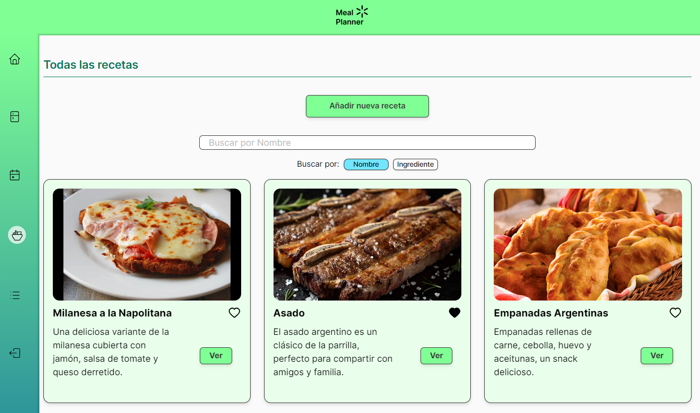

#**Meal Planner**

## Descripción

Proyecto pensado para realizar seguimiento de los ingredientes que tiene a mano el usuario y/o completar un calendario de comidas para solucionar la pregunta repetitiva _¿qué comemos hoy?_.
Además, dependiendo los ingredientes que posea el usuario se sugerirán comidas y se podrán ver sus respectivas recetas. También podrá generar una _Lista de Super_, la cuál compara los ingredientes en posesión del usuario con los necesarios para realizar todas las comidas que el mismo completó en el calendario semanal.

## Meal Planner cuenta con 5 secciones:

- **Inicio:** aquí el usuario podrá ver su perfil y editar su descripción y foto de perfil, así como podrá también añadir edad, sexo y lugar de residencia. Además cuenta con 3 mini-paneles que mostrarán las comidas del día, un extracto de su despensa y las recetas destacadas de la semana.
- **Despensa:** en esta sección el usuario debe, apretando el botón "Añadir alimento" y completando el formulario, agregar todos los ingredientes que posea en su hogar. Esto facilitará la sugerencia de comidas según ingredientes disponibles. También podrá ver todo lo que tenga separado por secciones: _Vegetales/Frutas, Alacena, Carnes y Frescos/Lácteos_.
- **Calendario:** el usuario podrá añadir Almuerzo y Cena a cada día, pudiendo elegir entre comidas disponibles y todas las recetas. Al finalizar, deberá presionar el botón **Guardar**
- **Recetas:** aquí podrá ver todas las recetas disponibles, así como podrá agregar nuevas. Además, podrá poner en Favoritos recetas, y así se mostrarán en el carrusel que está en esta misma sección. También hay otro carrusel que muestra las comidas destacadas de la semana.
- **Lista de compras:** al apretar el botón _Generar lista de compras_, la aplicación calculará los ingredientes que el usuario le faltan para poder realizar todas las recetas que anteriormente seleccionó y guardó en el Calendario semanal. Esta lista tiene la finalidad de ser usada en el Supermercado, podrás ir chequeando todo aquello que vayas consiguiendo.

## Levantar el proyecto localmente:

Para poder levantar el proyecto, deberás seguir estos pasos:

- Git Clone al repositorio.
- Cuando ya lo tengas en tu directorio, deberás hacer npm install, para instalar todas las dependencias correspondientes.
- Necesitarás conseguir un proveedor de bases de datos MySQL y hacer también las credenciales de NextAuth, las cuáles irán dentro de un archivo .env y .env.local, respectivamente.
- Al tener estos datos, por último, tienes que hacer npx prisma generate.
- npm run dev, unos segundos, y el proyecto estará levantado y corriendo en tu localhost:3000!

_Proyecto realizado por: **Nicolas Gabrieloni, Alejo Paulón y Julián Corbo** para Escuelita 2.0, de Crombie.dev_
